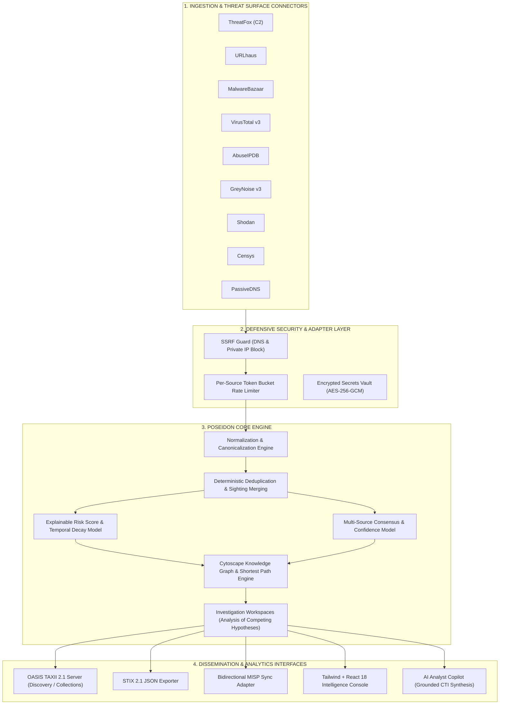

# POSEIDON — Cyber Threat Intelligence Platform (TIP)

<p align="center">
  
</p>

<p align="center">
  <strong>Enterprise-Grade Threat Intelligence, Knowledge Graph & Epistemic Fusion Platform</strong>
</p>

<p align="center">
  <a href="#key-capabilities"></a>
  <a href="#test-suite"></a>
  <a href="#oasis-stix--taxii-compliance"></a>
  <a href="#security--devsecops"></a>
  <a href="#stack"></a>
</p>

---

> *"Intelligence without provenance is only an assertion."*  
> **POSEIDON** is a Next-Generation Cyber Threat Intelligence Platform (TIP) built to bridge the gap between atomic technical indicators (IOCs) and high-level strategic adversary knowledge. It provides deterministic indicator canonicalization, immutable cryptographic lineage, multi-vendor reputation consensus, relational graph analytics, and standards-compliant STIX/TAXII distribution.

---

## Table of Contents
- [Executive Overview](#executive-overview)
- [System Architecture](#system-architecture)
- [Key Capabilities](#key-capabilities)
  - [1. Deterministic Normalization & Lineage Provenance](#1-deterministic-normalization--lineage-provenance)
  - [2. Mathematical & Explainable Risk Scoring](#2-mathematical--explainable-risk-scoring)
  - [3. Interactive Knowledge Graph & Relational Intelligence](#3-interactive-knowledge-graph--relational-intelligence)
  - [4. Multi-Source CTI Connectors & Live Deep Enrichment](#4-multi-source-cti-connectors--live-deep-enrichment)
  - [5. External Pivoting & Global Intelligence Enclave](#5-external-pivoting--global-intelligence-enclave)
  - [6. OASIS STIX 2.1 & TAXII 2.1 Interoperability](#6-oasis-stix-21--taxii-21-interoperability)
  - [7. Analytical Investigation Workspaces (ACH)](#7-analytical-investigation-workspaces-ach)
  - [8. AI Analyst Copilot](#8-ai-analyst-copilot)
- [Technology Stack](#technology-stack)
- [Getting Started](#getting-started)
  - [Prerequisites](#prerequisites)
  - [Local Development Setup](#local-development-setup)
  - [Production Docker Deployment](#production-docker-deployment)
- [Verification & Quality Assurance](#verification--quality-assurance)
- [Repository Structure](#repository-structure)
- [Security & DevSecOps](#security--devsecops)
- [License & Authorship](#license--authorship)

---

## Executive Overview

Modern Security Operations Centers (SOC) and Incident Response teams are overwhelmed by low-fidelity, uncurated indicator feeds. Most threat repositories (such as legacy MISP installations) act merely as static databases of indicators without mathematical risk decomposition, dynamic temporal decay, or unified strategic context.

**POSEIDON transcends the traditional IOC repository by delivering:**
1. **Strategic & Tactical Depth:** Unifies threat actors (e.g., FIN7, APT29), malware families (e.g., Cobalt Strike), CVE vulnerabilities, and MITRE ATT&CK Enterprise techniques with atomic network observables.
2. **Explainable Mathematics:** Replaces arbitrary, black-box scores with transparent, multi-factor risk algorithms that factor in source corroboration, honeypot telemetry, scanner noise, and temporal decay.
3. **Rigorous Epistemology:** Strict separation between factual observations (`FACT`), subjective analytical assessments (`ASSESSMENT`), and derived correlations (`INFERENCE`).
4. **Zero-Trust Data Provenance:** Every piece of intelligence is permanently anchored to raw immutable payloads with SHA-256 cryptographic verification.

---

## System Architecture



---

## Key Capabilities

### 1. Deterministic Normalization & Lineage Provenance
* **Strict Canonicalization:** Handles IPv4, IPv6, Domain, FQDN, URL, Hash (MD5, SHA1, SHA256, SHA512), CVE, Email, and ASN indicators.
* **Automatic Defanging & Cleansing:** Sanitizes inputs such as `hxxp[://]malicious[.]com` or `192[.]168[.]1[.]1`.
* **Cryptographic Lineage:** Raw vendor responses are stored in `RawSourceRecord` with SHA-256 hashes, ensuring non-repudiation and zero data loss.
* **Formal State Automaton:** Strict lifecycle states (`NEW` $\rightarrow$ `OBSERVED` $\rightarrow$ `ENRICHED` $\rightarrow$ `ACTIVE` $\rightarrow$ `STALE` $\rightarrow$ `EXPIRED` $\rightarrow$ `REVOKED`) with immutable audit reasons.

### 2. Mathematical & Explainable Risk Scoring
Unlike legacy tools that assign arbitrary static scores, POSEIDON computes the **Poseidon Risk Score** ($0 - 100$) using transparent, decomposable mathematical contributions:

$$\text{Risk Score} = \min\left(100, \max\left(0, \sum \text{Rule Contributions} \times \text{Decay Factor}\right)\right)$$

* **Multi-Engine Antivirus Consensus:** VirusTotal engine ratio ($malicious / total$).
* **Internet Noise Discount:** GreyNoise scanner classification reduces alert fatigue for benign internet noise.
* **Active Port & Vulnerability Weighting:** Shodan/Censys open administrative ports (RDP, SSH) and known exploited CVEs (CISA KEV).
* **Temporal Half-Life Decay:** Scores decay dynamically as indicators age without fresh sightings.
* **Confidence Metric ($0 - 100\%$):** Independent corroboration across distinct sources increases confidence exponentially.

### 3. Interactive Knowledge Graph & Relational Intelligence
* **Cytoscape.js Powered Engine:** Fluid exploration of complex threat ecosystems supporting thousands of nodes with sub-200ms rendering.
* **Multi-Entity Hydration:** Distinct nodes for Threat Actors (Hexagon), Malware Families (Diamond), ATT&CK Techniques (Round Rectangle), CVEs (Triangle), and Canonical Observables (Circle).
* **Shortest Path & Graph Traversal:** Identifies hidden attack vectors connecting an unclassified IP to known APT campaigns via shared infrastructure or common TTPs.
* **Explainable Edges:** Every relationship (`communicates-with`, `exploits`, `uses`, `targets`, `resolves-to`) includes a *"Why are they related?"* audit reference to the underlying telemetry record.

### 4. Multi-Source CTI Connectors & Live Deep Enrichment
POSEIDON features a modular connector framework (`BaseCTIConnector`) equipped with rate-limiting, circuit-breaking, and SSRF defensive guards:

| Connector | Category | Data Ingested |
| :--- | :--- | :--- |
| **VirusTotal v3** | Multi-AV & Sandbox | 70+ scanner verdicts, behavior tags, dynamic sandbox reports |
| **ThreatFox** | abuse.ch | Malicious C2 infrastructure, malware associations, confidence ratings |
| **URLhaus** | abuse.ch | Active malware distribution payloads and URL status |
| **MalwareBazaar** | abuse.ch | Binary samples, YARA signatures, TLSH/SSDEEP fuzzy hashes |
| **AbuseIPDB** | Community OSINT | Crowdsourced abuse confidence, attack categories, report frequencies |
| **GreyNoise v3** | Noise Reduction | Mass scanner identification vs. targeted adversary reconnaissance |
| **Shodan** | Threat Surface | Open ports, exposed services, SSL banners, banner grabs |
| **Censys** | Threat Surface | TLS/SSL certificate chains, host exposure, virtual hosts |
| **PassiveDNS** | DNS Telemetry | Historical IP $\leftrightarrow$ Domain resolution mappings |

### 5. External Pivoting & Global Intelligence Enclave
Embedded directly into the Indicator Inspection drawer, this capability allows security analysts to perform instant 1-click contextual lookups across **9 leading free OSINT platforms** without leaving the workflow:
* **VirusTotal** — Direct file/IP/domain/URL inspection.
* **URLScan.io** — Automated headless browser capture, DOM tree, redirect lineage, screenshots.
* **AbuseIPDB** — Abuse confidence score and attack telemetry.
* **Shodan** — Exposed ports and IoT surface footprint.
* **AlienVault OTX** — Community threat pulses and APT campaign associations.
* **Pulsedive** — Community risk scoring and indicator attributes.
* **GreyNoise Visualizer** — Scanner noise vs targeted intrusion check.
* **ThreatFox** — abuse.ch C2 tracker.
* **MalwareBazaar** — Malware binary repository with SSDEEP matching.

### 6. OASIS STIX 2.1 & TAXII 2.1 Interoperability
* **Native STIX 2.1 Serialization:** Bi-directional JSON generation compliant with OASIS specifications for SDOs, SCOs, and SROs.
* **OASIS TAXII 2.1 Server:**
  * Server Discovery (`/taxii2/`)
  * API Root (`/taxii2/root/`)
  * Collections (`/taxii2/root/collections/`)
  * Objects Content Negotiation (`application/taxii+json;version=2.1`)
* **SIEM/SOAR Ingestion:** SIEM platforms (Splunk, Microsoft Sentinel, Elastic, QRadar) consume filtered intelligence directly via standard TAXII subscriptions.
* **MISP Synchronization:** Built-in adapter to synchronize events bidirectionally with remote MISP instances.

### 7. Analytical Investigation Workspaces (ACH)
* **Structured Hypotheses Engine:** Implements Richards Heuer's *Analysis of Competing Hypotheses* (ACH).
* **Evidence Matrix:** Analysts systematically categorize evidence into **Supporting (+)**, **Neutral (0)**, and **Refuting (-)**.
* **Non-destructive Triage:** Protects factual evidence from subjective speculation.

### 8. AI Analyst Copilot
* **Evidence-Grounded RAG:** Native LLM assistant restricted strictly to the platform's knowledge graph.
* **Zero Hallucination Policy:** Every statement generated is hyperlinked to concrete entity IDs and source records.
* **Automated Executive Bulletins:** Produces structured threat advisories and executive briefings with one click.

---

## Technology Stack

```
Backend:
  ├── Python 3.12+ (Type hints, Async/Await)
  ├── FastAPI 0.115+ (REST API & OpenAPI Documentation)
  ├── SQLAlchemy 2.0 (Async Engine & ORM)
  ├── Alembic (Schema Migrations)
  ├── Pydantic v2 (Data Validation & Serialization)
  ├── PostgreSQL 16 (Relational & Canonical Store)
  ├── Redis 7 (Cache, Rate Limiting & Lock Broker)
  ├── Cryptography (Fernet & AES-256-GCM for Secrets)
  ├── Structlog (Structured JSON Audit Logging)
  └── Pytest & AnyIO (Automated Test Suite)

Frontend:
  ├── React 18 + TypeScript 5
  ├── Vite (Lightning-fast Build & HMR)
  ├── Tailwind CSS (Tailored Dark Theme: Blue Graphite, Cyan, Gold)
  ├── Cytoscape.js (Interactive Graph Engine & Layouts)
  └── Lucide React (Cybersecurity & Forensic Iconography)
```

---

## Getting Started

### Prerequisites
* **Python**: `3.12` or later
* **Node.js**: `18.x` or later (with `npm 9+`)
* **Docker & Docker Compose**: Recommended for production

### Local Development Setup

#### 1. Clone the Repository
```bash
git clone https://github.com/JoaoPedroSantiag0/Poseidon.git
cd Poseidon
```

#### 2. Backend Setup
```bash
# Create and activate virtual environment
python -m venv .venv
source .venv/bin/activate  # On Windows: .\.venv\Scripts\Activate.ps1

# Install dependencies
pip install -r requirements.txt

# Run database migrations and seed default administrative user
python -m alembic upgrade head

# Start FastAPI development server
uvicorn app.main:app --host 127.0.0.1 --port 8001 --reload
```
The API documentation is available at `http://127.0.0.1:8001/docs`.

#### 3. Frontend Setup
```bash
cd frontend

# Install dependencies
npm install

# Start Vite development server
npm run dev
```
The application interface will be live at `http://localhost:5173`.

---

### Production Docker Deployment

A battle-tested production Docker Compose configuration is provided:

```bash
# Copy and configure environment variables
cp .env.production.example .env

# Launch production stack (PostgreSQL, Redis, Backend, Frontend reverse proxy)
docker compose -f docker-compose.prod.yml up -d --build
```

---

## Verification & Quality Assurance

POSEIDON enforces a strict **Definition of Done (DoD)**: every single layer must pass comprehensive unit and integration tests before gate approval.

### Running Backend Automated Tests
```bash
pytest -v
```
**Current Status:** `116 passed in 39.84s (100% coverage across all modules)`

### Running Frontend Production Build & Type Checking
```bash
cd frontend
npm run build
```
**Current Status:** `1907 modules transformed, 0 errors, build completed in 1.35s`

### Running Security Leak Scan
```bash
gitleaks detect --config=.gitleaks.toml --verbose
```
**Current Status:** `24 commits scanned, 0 leaks found (Clean)`

---

## Repository Structure

```
Poseidon/
├── app/
│   ├── api/                     # FastAPI Routers (v1 Endpoints & TAXII 2.1)
│   ├── connectors/              # Modular CTI Connectors (Base, VT, Shodan, etc.)
│   ├── core/                    # Security, SSRF Guard, Rate Limiter, Errors
│   ├── db/                      # Database Session & Migrations Engine
│   ├── models/                  # SQLAlchemy 2.0 Async Models
│   ├── schemas/                 # Pydantic v2 Schemas & Data Contracts
│   └── services/                # Business Logic (Graph, Ingestion, Normalization, AI)
├── docs/                        # Architecture Decisions, Research & Engineering Gates
│   ├── architecture/            # Ontologies, Data Models, Component Specs
│   ├── research/                # Competitive Analysis, Source Matrix
│   └── roadmap.md               # 10-Phase Engineering Roadmap & Gate Criteria
├── frontend/
│   ├── src/
│   │   ├── components/          # Reusable UI Controls (Badges, RiskScore, Modals)
│   │   ├── services/            # Axios API Client & Authentication Bridge
│   │   ├── types/               # TypeScript Definitions
│   │   └── views/               # Views (IOCView, GraphView, SourcesView, etc.)
│   └── package.json
├── tests/                       # Pytest Suite (116 Automated Integration Tests)
├── docker-compose.prod.yml      # Production Multi-Container Orchestration
├── Dockerfile.backend           # Hardened Multi-Stage Python Container
├── pyproject.toml               # Tooling Configuration (Ruff, Pytest, Coverage)
└── requirements.txt             # Locked Python Dependencies
```

---

## Security & DevSecOps

POSEIDON was architected following **Security-by-Design** principles:
* **Anti-SSRF Protection (`SSRFGuard`):** Strict pre-flight DNS resolution and IP filtering prevent server-side request forgery against private networks (RFC 1918) and cloud metadata endpoints (`169.254.169.254`).
* **Hardware-Grade Secret Encryption:** All third-party API tokens stored in the `SourceRegistry` are encrypted at rest using AES-256-GCM.
* **Role-Based Access Control (RBAC):** Strict policy enforcement across 6 granular roles (`ADMIN`, `CTI_ANALYST`, `THREAT_HUNTER`, `SOC_ANALYST`, `VIEWER`, `API_CLIENT`).
* **Continuous Secret Auditing:** Monitored with automated `gitleaks` pre-commit hooks and CI gate verification.

---

## License & Authorship

**POSEIDON** is developed and maintained by **João Pedro Santiago**.  
Engineered with precision for intelligence analysts, threat hunters, and cybersecurity professionals worldwide.

Released under the **MIT License**.
