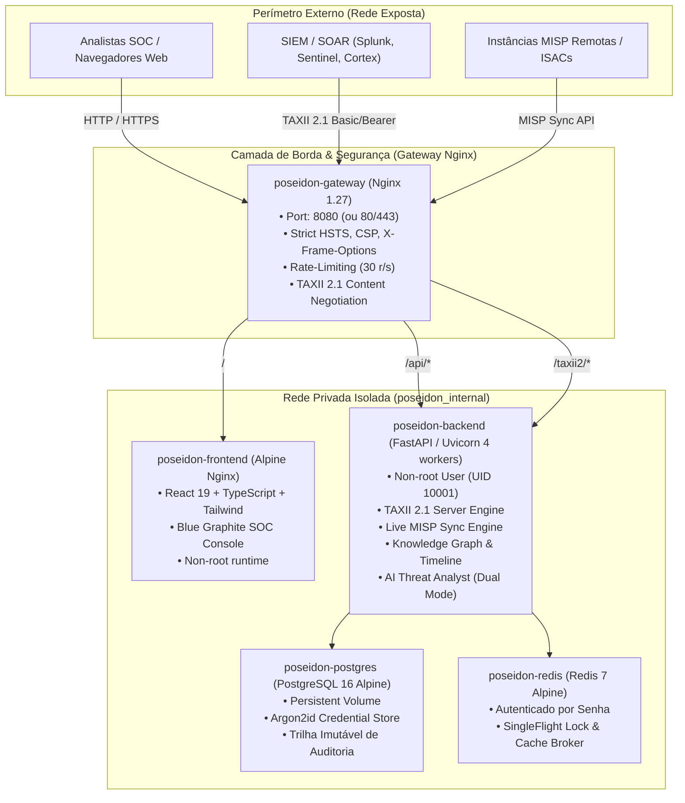

# POSEIDON CTI Platform — Production Deployment & Operations Runbook

> **Documento:** `docs/DEPLOYMENT.md`  
> **Classificação:** Guia Oficial de Engenharia, Operações & DevSecOps  
> **Versão da Plataforma:** POSEIDON CTI Enterprise 1.0  
> **Padrões Mandatórios:** Prompt 01 (Arquitetura), Prompt 02 (UX SOC), Prompt 03 (Excelência de Engenharia)  

---

## 1. Visão Geral da Arquitetura de Produção

A arquitetura do **POSEIDON** foi empacotada em uma topologia multi-container isolada, orquestrada via Docker Compose, em estrita conformidade com os princípios de **Privilégio Mínimo**, **Defesa em Profundidade** e **Isolamento de Falhas**.



---

## 2. Requisitos de Infraestrutura

| Componente | Requisito Mínimo | Recomendado para Produção |
| :--- | :--- | :--- |
| **CPU** | 2 vCPUs | 4 a 8 vCPUs |
| **Memória RAM** | 4 GB | 8 a 16 GB |
| **Armazenamento** | 30 GB SSD (NVMe recomendado) | 100 GB+ SSD com RAID/Snapshot |
| **Sistema Operacional** | Linux (Ubuntu 22.04 LTS+, Debian 12+, RHEL 9+) | Linux com Kernel hardened |
| **Docker Engine** | Docker 24.0+ | Docker 26.0+ |
| **Docker Compose** | Compose v2.20+ | Compose v2.27+ |

---

## 3. Deploy em 1 Comando (Turnkey Quickstart)

### Passo 3.1: Configurar Variáveis de Ambiente
Copie o template de produção e ajuste as credenciais mestras:
```bash
cp .env.production.example .env
```

Gere chaves seguras e atualize no `.env`:
```bash
# Gerar SECRET_KEY aleatória de 64 caracteres
openssl rand -hex 32

# Gerar senhas fortes para PostgreSQL e Redis
openssl rand -base64 24
```

### Passo 3.2: Inicializar os Contêineres
Execute o comando unificado de inicialização:
```bash
docker compose -f docker-compose.prod.yml up -d --build
```

O Docker Compose executará automaticamente:
1. Subida do **PostgreSQL 16** e verificação de integridade via `healthcheck`.
2. Subida do **Redis 7** protegido com senha.
3. Build multi-stage do **Backend Python 3.12** com 4 workers Uvicorn sob usuário `poseidon` (UID 10001).
4. Build multi-stage do **Frontend Vite React** e publicação no Nginx Alpine.
5. Subida do **Edge Gateway Nginx** roteando `/api/`, `/taxii2/` e `/` na porta `8080`.

---

## 4. Checklist de Verificação e Smoke Testing

Após a subida dos contêineres, execute os seguintes testes para validar a saúde operacional:

### 1. Verificação do Gateway de Borda
```bash
curl -i http://localhost:8080/healthz
```
* **Esperado:** `HTTP/1.1 200 OK` com payload `poseidon-gateway-healthy`.

### 2. Verificação da API do Backend & Banco de Dados
```bash
curl -i http://localhost:8080/api/v1/health
```
* **Esperado:** `HTTP/1.1 200 OK` com `{"status":"healthy","database":"connected","version":"1.0.0"}`.

### 3. Verificação do Servidor OASIS TAXII 2.1
```bash
curl -i http://localhost:8080/taxii2/ \
  -H "Accept: application/taxii+json;version=2.1"
```
* **Esperado:** `HTTP/1.1 200 OK` com `Content-Type: application/taxii+json;version=2.1` e discovery payload listando as coleções padrão (`high-confidence-iocs`, `malware-and-actors`, `bulletins`, `community-feed`).

### 4. Acesso ao Console SOC Frontend
Abra no navegador: `http://localhost:8080`
* **Login padrão:** `admin@poseidon.sec`
* **Senha inicial:** Valor configurado em `FIRST_ADMIN_PASSWORD` (padrão: `PoseidonRoot2026!Secure`).
* *Nota: Troque a senha imediatamente após o primeiro acesso na aba Configurações.*

---

## 5. Operação em Modo Air-Gapped (Zero Cloud Lock-in)

O POSEIDON foi arquitetado para operar em enclaves isolados e redes restritas (SCADA, Defesa, Inteligência militar):
* **AI Analyst Local:** Opera sem chaves OpenAI/Gemini/Anthropic, ativando deterministicamente o **Heuristic Graph Reasoner** para correlação matemática e cálculo bayesiano de confiança.
* **Conectores em Modo Offline:** Conectores externos (Shodan, Censys, Passive DNS, AbuseIPDB) entram em modo de contingência transparente caso a conexão externa esteja desativada ou não haja API keys cadastradas.
* **Preservação de Dados:** 100% dos dados, grafos, IOCs e relatórios residem nos volumes locais `poseidon_postgres_data` e `poseidon_redis_data`.

---

## 6. Procedimentos de Backup & Disaster Recovery

### Backup do Banco de Dados (Snapshot Frio/Quente)
```bash
docker exec -t poseidon-postgres pg_dump -U poseidon_admin -F c -b -v -f /var/lib/postgresql/data/poseidon_backup_$(date +%Y%m%d_%H%M%S).dump poseidon
```

### Restauração do Banco de Dados
```bash
docker exec -i poseidon-postgres pg_restore -U poseidon_admin -d poseidon -v < caminho/do/backup.dump
```

### Backup dos Volumes Persistentes
```bash
docker run --rm -v poseidon_postgres_data:/volume -v $(pwd)/backups:/backup alpine tar -czf /backup/pgdata_$(date +%Y%m%d).tar.gz -C /volume .
```

---

## 7. Integração com SIEMs e Ferramentas Externas via TAXII 2.1

O POSEIDON expõe endpoints TAXII 2.1 prontos para ingestão direta em ferramentas de mercado:

* **URL de Descoberta:** `http://<seu-ip>:8080/taxii2/`
* **Autenticação:** Suporta **HTTP Basic Auth** (`email:senha`) ou **Bearer Token** (`Authorization: Bearer <jwt>`).
* **Exemplo Splunk TAXII Client:**
  - *Poll URL:* `http://<seu-ip>:8080/taxii2/root/collections/pos-col-high-confidence/objects/`
  - *Auth:* Basic Authentication com credenciais do usuário analista.
* **Exemplo Microsoft Sentinel Threat Intelligence:**
  - Conector TAXII 2.1 apontando para `http://<seu-ip>:8080/taxii2/` com coleção `pos-col-high-confidence`.

---

## 8. Comandos de Manutenção do Operador

```bash
# Ver logs unificados estruturados em tempo real
docker compose -f docker-compose.prod.yml logs -f --tail=100

# Reiniciar um serviço específico sem indisponibilizar a plataforma
docker compose -f docker-compose.prod.yml restart backend

# Atualizar versão do código e recriar contêineres
docker compose -f docker-compose.prod.yml up -d --build --no-deps backend frontend

# Parar a plataforma com segurança
docker compose -f docker-compose.prod.yml down
```
