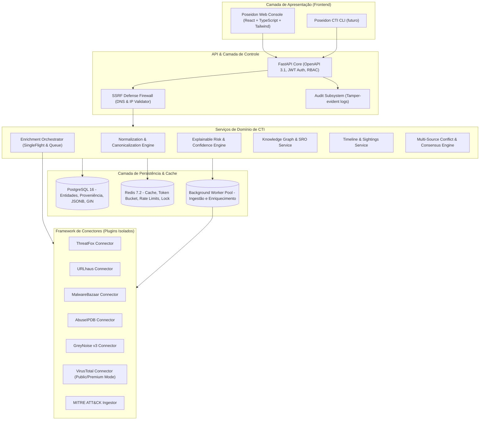
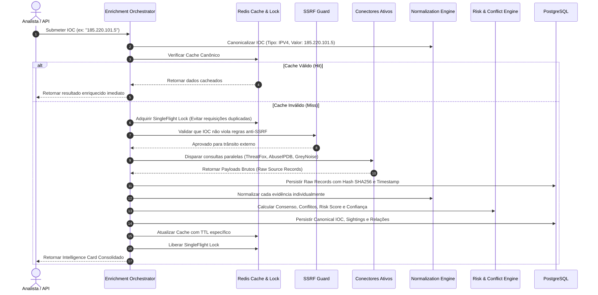

# POSEIDON CTI — Arquitetura de Sistemas & Engenharia de Plataforma

> **Documento:** `docs/architecture/architecture.md`  
> **Status:** Aprovado para Phase 0 (Research & Foundation)  
> **Classificação:** Engenharia de Software & Arquitetura de CTI  
> **Data:** 2026-09-20  

---

## 1. Visão Geral da Arquitetura do Sistema

O **POSEIDON** é uma plataforma modular de **Cyber Threat Intelligence (CTI)** desenhada sob o padrão de **Clean Architecture (Hexagonal / Ports and Adapters)**, com desacoplamento rigoroso entre regras de negócio de CTI, conectores de fontes externas, persistência e interfaces de apresentação.



---

## 2. Escolha e Justificativa da Stack Tecnológica

### 2.1 Backend: Python 3.12+ com FastAPI e Pydantic v2
* **Motivação:**
  * O ecossistema de CTI global (STIX 2.1, PyMISP, Attack-Scripts, YARA, CybOX, TLSH) é predominantemente fundamentado em Python.
  * O **FastAPI** provê suporte assíncrono nativo de alta performance (`asyncio`/`uvicorn`), validação estrita em tempo de compilação/runtime via **Pydantic v2** (escrito em Rust), e documentação OpenAPI 3.1 interativa e automática.
  * Tipagem estrita com `mypy` e `ruff` para máxima integridade e conformidade de software.

### 2.2 Banco de Dados: PostgreSQL 16+
* **Motivação:**
  * Evita a fragilidade operacional do OpenSearch como banco relacional primário.
  * O PostgreSQL oferece suporte ACID transacional robusto, fundamental para preservação da integridade referencial entre Fontes, Evidências Brutas, Registros Canônicos e Relacionamentos.
  * Suporte avançado a colunas `JSONB` com índices `GIN` para payloads brutos e metadados dinâmicos de provedores.
  * Extensão `pg_trgm` para buscas fuzzy de alta velocidade por nomes de malware, aliases de atores e hashes parciais.
  * Capacidade de modelagem de grafos recursivos (Common Table Expressions - CTEs recursivos) para navegação eficiente de nós e relacionamentos até 5 níveis de profundidade sem a sobrecarga operacional de um banco de grafo dedicado na fase inicial.

### 2.3 Cache & Controle de Concorrência: Redis 7.2+
* **Motivação:**
  * Implementação de rate limiting de latência sub-milissegundo via algoritmos atômicos de **Token Bucket** (Lua scripts).
  * Cache distribuído para consultas frequentes de IOCs com TTLs dinâmicos por tipo (evita consumo desnecessário de cotas de APIs externas).
  * Mecanismo de **SingleFlight / Request Coalescing** através de Redis Distributed Locks (`Redlock`), impedindo que múltiplos analistas consultando o mesmo IP disparem requisições simultâneas para as fontes.

### 2.4 Frontend: React 18 + TypeScript + Vite + Tailwind CSS
* **Motivação:**
  * Interface dark, profissional e analítica (design inspirado em consoles de SOC de alta densidade).
  * Renderização de grafos via **Cytoscape.js** / **React Flow** com layout otimizado e filtragem dinâmica por TTPs e tipos de entidades.
  * Tabelas virtualizadas de alto desempenho (**TanStack Table**) para suporte à visualização de dezenas de milhares de IOCs sem travamentos de DOM.
  * Gerenciamento de estado de servidor e sincronização de cache de requisições com **TanStack Query**.

---

## 3. Connector Framework (`BaseCTIConnector` SDK)

Nenhum conector externo é acoplado diretamente às rotas da API ou aos modelos do banco de dados. Cada integração é um plugin independente localizado em `app/connectors/<nome_do_conector>/` e herda da classe abstrata `BaseCTIConnector`:

```python
from abc import ABC, abstractmethod
from typing import Any, Dict, List, Optional
from pydantic import BaseModel
from app.models.enums import IOCType, SourceCategory, SourceHealthStatus

class ConnectorMetadata(BaseModel):
    id: str
    name: str
    vendor: str
    category: SourceCategory
    documentation_url: str
    api_version: str
    supported_ioc_types: List[IOCType]
    supported_capabilities: List[str]  # ["lookup", "enrich", "feed", "search"]
    requires_auth: bool
    is_commercial: bool

class RateLimitSpec(BaseModel):
    requests_per_minute: int
    requests_per_day: Optional[int] = None
    burst_capacity: int = 1
    cooldown_seconds_on_429: int = 60

class BaseCTIConnector(ABC):
    """Contrato obrigatório para todos os conectores de inteligência do Poseidon."""

    @abstractmethod
    def metadata(self) -> ConnectorMetadata:
        """Retorna metadados declarativos do conector."""
        pass

    @abstractmethod
    async def validate_config(self, config: Dict[str, Any]) -> bool:
        """Valida credenciais, chaves e endpoints informados."""
        pass

    @abstractmethod
    async def health_check(self) -> SourceHealthStatus:
        """Executa probe de conectividade e validação de autenticação/quota."""
        pass

    @abstractmethod
    async def lookup_ioc(self, ioc_type: IOCType, value: str) -> Optional[Dict[str, Any]]:
        """Realiza consulta atômica individual do indicador na fonte externa."""
        pass

    @abstractmethod
    async def normalize_response(self, raw_payload: Dict[str, Any], ioc_type: IOCType, raw_value: str) -> Dict[str, Any]:
        """Converte o payload bruto proprietário da fonte para o formato canônico do Poseidon."""
        pass

    @abstractmethod
    def get_rate_limits(self) -> RateLimitSpec:
        """Retorna as regras de consumo de API exigidas pela fonte."""
        pass
```

### Estados de Saúde do Conector (Source Health Lifecycle)
O Poseidon monitora ativamente cada conector:
* `CONNECTED`: Conector operando dentro dos parâmetros de latência e cotas normais.
* `DEGRADED`: Latência elevada ou falhas esporádicas de conexão (< 20% de erros).
* `RATE_LIMITED`: Resposta HTTP 429 recebida; conector pausado com backoff ativo.
* `AUTH_FAILED`: Chave de API inválida, revogada ou expirada (alerta prioritário).
* `QUOTA_EXCEEDED`: Cota diária/semanal informada pelo cabeçalho ou payload esgotada.
* `SOURCE_UNAVAILABLE`: Falha de DNS ou indisponibilidade de servidor do fornecedor.
* `CONFIGURATION_ERROR`: Erro de parsing de parâmetros ou endpoint mal formatado.
* `DISABLED`: Desativado administrativamente.

---

## 4. Orquestrador de Enriquecimento (Enrichment Orchestration)

Quando um IOC é submetido para enriquecimento (sob demanda, via API ou via feed), o **Enrichment Orchestrator** executa o pipeline determinístico:



### 4.1 Tratamento Rigoroso de Evidência Negativa
* Se o VirusTotal ou GreyNoise responderem que não possuem registros sobre um hash ou IP:
  * O Poseidon **NUNCA** classifica o IOC como `BENIGNO` apenas pela ausência de dados.
  * O estado da evidência daquela fonte é gravado expressamente como `NO_DATA_REPORTED`.
  * Essa distinção é vital para analistas: ausência de detecção por um antivírus não atesta inocuidade de um artefato novo (Zero-Day).

### 4.2 Mecanismo de Detecção de Conflitos (Source Conflict Engine)
* Se a Fonte A (ThreatFox) categorizar um IP como `Malicious C2` e a Fonte B (GreyNoise) reportar como `Benign / RIOT (Microsoft Azure)`:
  * O sistema não descarta silenciosamente nenhuma das duas fontes.
  * É gerado um alerta de `INTELLIGENCE_CONFLICT`.
  * O Poseidon Confidence Score é rebaixado preventivamente para `MEDIUM_CONFIDENCE` ou `LOW_CONFIDENCE`, e o Intelligence Card exibe de forma destacada: *"Fontes divergem sobre a natureza desta infraestrutura (possível hospedagem compartilhada, IP reciclado ou comprometimento de nuvem legítima)"*.

---

## 5. Arquitetura de Segurança Defensiva

### 5.1 Proteção Centralizada contra SSRF (Server-Side Request Forgery)
Como o Poseidon realiza lookups e requisições dinâmicas com base em URLs e endereços informados em relatórios de ameaças, é estritamente proibido que a infraestrutura realize chamadas inadvertidas contra redes internas ou endpoints de metadados de nuvem.

O módulo `SSRFGuard` atua antes de qualquer requisição externa:
1. **Validação de Esquema:** Apenas `http://` e `https://` são permitidos. Esquemas como `file://`, `gopher://`, `ftp://` ou `dict://` são abortados sumariamente.
2. **Resolução de DNS Segura Pré-Requisição:**
   * O Poseidon resolve o nome de domínio para endereço IP antes de abrir o socket HTTP.
   * O IP de destino é validado contra a **Blocklist de Redes Privadas e Reservadas**:
     * `127.0.0.0/8` (Loopback IPv4)
     * `::1/128` (Loopback IPv6)
     * `10.0.0.0/8`, `172.16.0.0/12`, `192.168.0.0/16` (RFC1918)
     * `169.254.0.0/16` (Link-Local)
     * `169.254.169.254` (Cloud Instance Metadata Service - AWS/GCP/Azure)
     * `100.64.0.0/10` (Carrier-Grade NAT)
     * `fc00::/7` (IPv6 Unique Local)
3. **Bloqueio de DNS Rebinding:** O socket HTTP é forçado a conectar diretamente no IP resolvido e validado, ignorando nova resolução no handshake TLS.

### 5.2 Gerenciamento Seguro de Segredos e API Keys
* **Nenhum segredo no código:** Proibição estrita de hard-coding de chaves de API, tokens ou credenciais.
* **Criptografia em Repouso:** Todas as chaves de API cadastradas por administradores na interface de configurações são cifradas com **AES-256-GCM** antes de serem persistidas no PostgreSQL. A chave mestra de derivação (`POSEIDON_SECRET_KEY`) reside exclusivamente em variáveis de ambiente ou secret managers.
* **Mascaramento e Redação:** Chaves de API nunca são retornadas completas em respostas de API ou logs. A interface administrativa expõe apenas os 4 últimos caracteres (ex: `****************9F3A`).

### 5.3 Controle de Acesso Baseado em Papéis (RBAC)
O Poseidon adota matriz de autorização granular:

| Ação / Módulo | ADMIN | CTI_ANALYST | THREAT_HUNTER | SOC_ANALYST | VIEWER | API_CLIENT |
| :--- | :---: | :---: | :---: | :---: | :---: | :---: |
| Consultar IOCs e Intelligence Cards | ✓ | ✓ | ✓ | ✓ | ✓ | ✓ |
| Solicitar Enriquecimento Manual | ✓ | ✓ | ✓ | ✓ | ✗ | ✓ |
| Criar / Editar Investigações | ✓ | ✓ | ✓ | ✗ | ✗ | ✗ |
| Registrar Hipóteses e Evidências | ✓ | ✓ | ✓ | ✗ | ✗ | ✗ |
| Inserir Overrides de Risco / Falsos Positivos | ✓ | ✓ | ✗ | ✗ | ✗ | ✗ |
| Configurar Conectores & Chaves de API | ✓ | ✗ | ✗ | ✗ | ✗ | ✗ |
| Visualizar Trilha de Auditoria | ✓ | ✗ | ✗ | ✗ | ✗ | ✗ |
| Exportar Bundles STIX 2.1 / CSV | ✓ | ✓ | ✓ | ✓ | ✗ | ✓ |

### 5.4 Trilha de Auditoria Imutável (Audit Subsystem)
Todas as operações críticas geram registros de auditoria estruturados (`AuditLogRecord`):
* Quem executou (User ID, IP de origem, User Agent);
* O que foi modificado (Entidade, ID do registro, valor anterior, novo valor);
* Justificativa obrigatória para alterações manuais de risco e falsos positivos;
* Timestamp de precisão UTC.

---

## 6. Observabilidade & Métricas de Engenharia

O Poseidon expõe métricas nativas formatadas para Prometheus no endpoint seguro `/metrics`:
* `poseidon_source_requests_total{source, status}`: Total de requisições disparadas por provedor;
* `poseidon_source_latency_seconds{source}`: Histograma de latência de resposta externa;
* `poseidon_rate_limit_hits_total{source}`: Contagem de respostas HTTP 429 recebidas;
* `poseidon_ioc_ingestion_total{type, source}`: Volume de novos IOCs ingeridos;
* `poseidon_enrichment_queue_depth`: Tamanho atual da fila assíncrona de enriquecimento;
* `poseidon_intelligence_conflicts_total`: Quantidade de divergências detectadas entre fontes.

Logs são estruturados em JSON via biblioteca `structlog`, com injeção automática de `trace_id` e `tenant_id` em todo o ciclo de vida da requisição.
