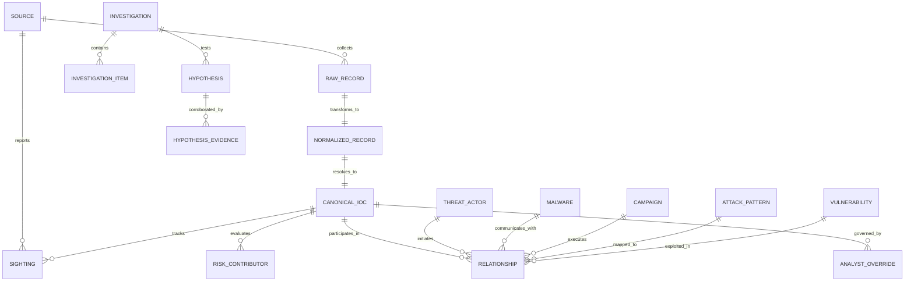
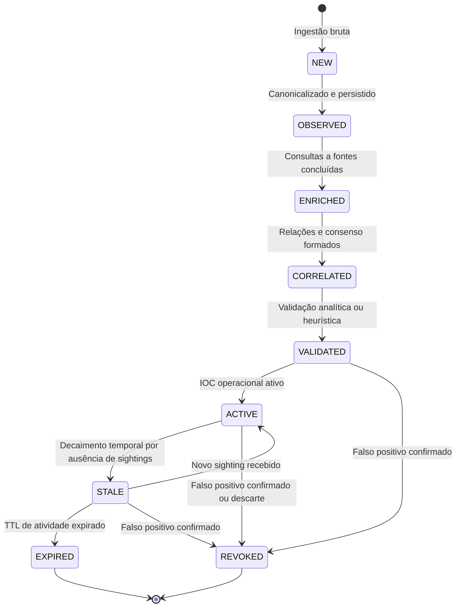

# POSEIDON CTI — Modelo de Dados Canônico & Ontologia de Inteligência

> **Documento:** `docs/architecture/data-model.md`  
> **Status:** Aprovado para Phase 0 (Research & Foundation)  
> **Classificação:** Arquitetura de Dados & Modelagem Ontológica  
> **Data:** 2026-09-20  

---

## 1. Princípios Fundamentais do Modelo de Dados

O modelo de dados do **POSEIDON** foi estruturado a partir de quatro axiomas inegociáveis:

1. **"Intelligence without provenance is only an assertion":**  
   Nenhum dado é gravado no sistema sem associação formal a uma fonte, carimbo de data/hora de coleta, método de extração, payload bruto original e nível de confiança atribuído.
2. **Distinção Estrita entre Observable (SCO) e Indicator (SDO):**  
   * **Observable (Cyber-observable):** Um fato observado no mundo digital (ex: `8.8.8.8`, `login.microsoftonline.com`, hash `e3b0c44298fc1c149afbf4c8996fb92427ae41e4649b934ca495991b7852b855`). Observáveis não são inerentemente maliciosos; são entidades factuais puras.
   * **Indicator:** Um padrão de detecção e contextualização que avalia se a presença ou comportamento de um observável denota atividade adversária (ex: *"O endereço IP 185.x.x.x atuou como C2 ativo do malware LummaStealer em 15/09/2026"*).
3. **Imutabilidade da Evidência Bruta (Raw) vs. Flexibilidade Canônica:**  
   O payload JSON/XML original recebido de qualquer conector externo é preservado integralmente com hash criptográfico SHA256. A normalização gera registros canônicos derivados, garantindo reprodutibilidade e auditoria forense.
4. **Interoperabilidade Nativa com STIX 2.1:**  
   O modelo de dados suporta exportação e importação bidirecional de bundles STIX 2.1 sem perdas semânticas, ao mesmo tempo em que provê índices relacionais de alta velocidade e tabelas em PostgreSQL para consultas em tempo real.

---

## 2. Diagrama Conceitual de Entidades (Entity-Relationship)



---

## 3. Classificação Canônica de Asserções de Inteligência

Para que analistas e sistemas de decisão automatizados distingam fatos verificados de especulações ou correlações heurísticas, toda asserção, indicador ou relacionamento no Poseidon possui um atributo obrigatório `assertion_type`:

| Tipo de Asserção | Definição Semântica | Exemplo de Aplicação | Nível de Certeza Base |
| :--- | :--- | :--- | :--- |
| `OBSERVED` | Fato técnico registrado por sensor, sonda ou telemetria direta sem inferência adicional. | Conexão de rede TCP detectada para o IP 195.12.50.2 na porta 443. | Máximo (Fato empírico) |
| `REPORTED` | Informação fornecida por fonte de inteligência externa (ThreatFox, AbuseIPDB, etc.). | ThreatFox reporta que o domínio `evil-c2.net` distribui RedLine Stealer. | Conforme reputação da fonte |
| `CORRELATED` | Associação estabelecida deterministicamente pelo Poseidon via múltiplos sinais coincidentes. | Domínio A e Domínio B resolvem para o mesmo IP incomum em uma janela de 2 horas. | Alto / Analítico |
| `INFERRED` | Associação probabilística derivada de heurísticas de infraestrutura (ASN, sub-redes, certificados similares). | O host X provavelmente pertence à infraestrutura de infostealer devido a JA4 fingerprint idêntica. | Médio |
| `ANALYST_ASSERTED` | Conclusão ou hipótese validada manualmente por um analista humano credenciado. | O analista marca o IP como falso positivo pertencente a CDN governamental. | Auditável (Com justificativa) |
| `AI_GENERATED_HYPOTHESIS` | Hipótese gerada por modelo de linguagem ou IA assistiva durante investigação assistida. | A IA sugere relação entre campanha X e campanha Y baseado em padrões de texto e TTPs comuns. | Hipotético (Exige validação) |

---

## 4. Tipagem Canônica de IOCs e Regras de Normalização

O Poseidon suporta os seguintes tipos canônicos de indicadores e observáveis, aplicando normalização rígida na ingestão:

```
CanonicalIOCType = (
    IPV4,
    IPV6,
    DOMAIN,
    FQDN,
    URL,
    HASH_MD5,
    HASH_SHA1,
    HASH_SHA256,
    HASH_SHA512,
    EMAIL_ADDRESS,
    AUTONOMOUS_SYSTEM,
    X509_CERTIFICATE_SHA256,
    JA3_FINGERPRINT,
    JA4_FINGERPRINT,
    USER_AGENT,
    MUTEX,
    WINDOWS_REGISTRY_KEY,
    CRYPTO_WALLET,
    CVE,
    SOFTWARE_PACKAGE
)
```

### Regras de Canonicalização por Tipo (Deterministic Normalization)
1. **IPv4 / IPv6:**
   * Remoção de espaços, tabs e parênteses de defang (ex: `192[.]168[.]1[.]1` $\rightarrow$ `192.168.1.1`).
   * Conversão para representação canônica RFC (IPv6 expandido/comprimido via `ipaddress.ip_address`).
   * Validação de intervalos reservados (RFC1918, Loopback, Link-Local, Multicast).
2. **Domain / FQDN:**
   * Conversão para minúsculas (`lowercase`).
   * Remoção de ponto final à direita (`evil.com.` $\rightarrow$ `evil.com`).
   * Conversão de caracteres IDN internacionais para Punycode (`xn--...`).
   * Desfangamento automático (ex: `hxxp://evil[.]com` $\rightarrow$ `evil.com`).
3. **URL:**
   * Normalização de esquema (`http://` ou `https://` em lowercase).
   * Hostname em lowercase e punycode.
   * Remoção de portas padrão explícitas (`:80` para HTTP, `:443` para HTTPS).
   * Preservação da ordenação canônica de query parameters quando aplicável.
   * Sanitização de fragments/hashes.
4. **Hashes Criptográficos (MD5, SHA1, SHA256, SHA512):**
   * Conversão integral para minúsculas (`lowercase`).
   * Validação rigorosa de comprimento e expressão regular hexadecimal (`^[a-f0-9]{32,128}$`).
   * Detecção unívoca do algoritmo com base no tamanho do digest (32 = MD5, 40 = SHA1, 64 = SHA256, 128 = SHA512).
5. **Email Address:**
   * Domínio em minúsculas (`user@EVIL.COM` $\rightarrow$ `user@evil.com`).
   * Parte local preservada exatamente como submetida para não invalidar hashes de identidade.
6. **CVE:**
   * Expressão regular estrita: `^CVE-\d{4}-\d{4,}$` em caixa alta (`CVE-2024-38077`).

---

## 5. Ciclo de Vida do IOC (Lifecycle State Machine)

O ciclo de vida de um indicador no Poseidon é governado pelo seguinte autômato de estados:



### Critérios de Transição
* `NEW`: Registro inserido no buffer de ingestão; aguarda validação sintática e canonicalização.
* `OBSERVED`: Registro canônico salvo com sua primeira evidência de proveniência.
* `ENRICHED`: Passou pelo pipeline do `Enrichment Orchestrator` (ThreatFox, AbuseIPDB, GreyNoise, etc.).
* `CORRELATED`: Relações com malware, threat actors, ASNs ou outros IOCs foram consolidadas.
* `VALIDATED`: Atributos de consistência técnica atingiram o limiar mínimo de integridade.
* `ACTIVE`: IOC de alta relevância com sightings recentes (dentro da janela de frescor, ex: < 30 dias).
* `STALE`: IOC sem novas observações dentro da janela configurada (ex: 30 a 90 dias); sofre redução progressiva de confiança (*confidence decay*).
* `EXPIRED`: IOC sem observação há mais de 90 dias ou expressamente expirado pela fonte (ex: ThreatFox IOC retirement).
* `REVOKED`: Indicador marcado como falso positivo por analista ou inserido em allowlist corporativa.

---

## 6. Rastreamento Estrito de Proveniência & Evidência

Toda evidência externa coletada é modelada pela entidade `RawSourceRecord` e associada a um `NormalizedEvidence`:

```typescript
interface RawSourceRecord {
  id: UUID;
  source_id: string;               // Ex: "threatfox", "abuseipdb"
  request_id: UUID;
  fetched_at: Timestamp;          // UTC ISO8601
  source_url: string;              // Endpoint consultado
  http_status: number;
  raw_payload: Record<string, any>;// Payload original JSON
  payload_sha256: string;         // Hash do payload bruto para não-repúdio
  parser_version: string;          // Ex: "v1.4.0"
}

interface NormalizedEvidence {
  id: UUID;
  canonical_ioc_id: UUID;
  raw_record_id: UUID;
  source_id: string;
  source_name: string;
  source_confidence: number;      // 0 a 100 conforme reportado pela fonte
  threat_type?: string;           // Ex: "botnet_cc", "payload_delivery"
  malware_family?: string;        // Ex: "lumma_stealer"
  first_seen_source?: Timestamp;
  last_seen_source?: Timestamp;
  assertion_type: AssertionType;  // REPORTED | OBSERVED
  attributes: Record<string, any>;
}
```

---

## 7. Modelo Matemático de Risco e Confiança

No Poseidon, **Risco** e **Confiança** são grandezas ortogonais e independentes:

$$\text{Risco} \in [0, 100] \quad \text{vs.} \quad \text{Confiança} \in [0, 100]$$

* **Risco (Impacto e Ameaça):** Avalia *quão danoso ou perigoso* é o indicador se for legítimo.
* **Confiança (Certeza Analítica):** Avalia *quão robustas e consistentes* são as evidências que sustentam a conclusão.

### 7.1 Algoritmo de Cálculo do Risk Score Explicável
O Poseidon Risk Score $R$ é a soma ponderada de contribuidores positivos (fatores de ameaça) e subtrativos (fatores mitigadores), truncado em $[0, 100]$:

$$R = \min\left(100, \max\left(0, \sum C_{pos} - \sum C_{neg} - D(t)\right)\right)$$

#### Exemplo de Contribuidores Positivos ($C_{pos}$):
* $+30$: Identificado como C2 ativo por fonte confiável (ThreatFox/URLhaus);
* $+25$: AbuseIPDB Abuse Confidence Score $> 80\%$;
* $+20$: Amostra associada a família de malware crítica (Ransomware, Infostealer);
* $+15$: Observação recente (sighting nas últimas 48 horas);
* $+10$: Corroboração por 3 ou mais fontes independentes;
* $+10$: Associação a Threat Actor conhecido ou campanha ativa.

#### Exemplo de Contribuidores Mitigadores ($C_{neg}$):
* $-30$: Infraestrutura identificada no GreyNoise RIOT (serviço benigno corporativo/CDN como Cloudflare, Google, Microsoft);
* $-20$: Endereço pertencente a ASN de DNS público respeitado (ex: 8.8.8.8, 1.1.1.1);
* $-15$: Domínio presente no Top 10.000 Tranco/Cisco Umbrella list;
* $-10$: Evidência benigna concorrente confirmada.

#### Fator de Decaimento Temporal ($D(t)$):
Para indicadores que dependem de infraestrutura volátil (IPs, URLs), aplica-se decaimento exponencial sobre a idade da última observação:

$$D(t) = \lambda \cdot \ln(1 + \Delta t)$$

Onde $\Delta t$ é o tempo decorrido desde o último sighting (em dias) e $\lambda$ é a taxa de decaimento específica do tipo de IOC (mais rápida para IP, nula para File Hash).

### 7.2 Algoritmo de Cálculo de Confiança (Confidence Score)
O Poseidon Confidence Score reflete a concordância entre fontes independentes e a confiabilidade intrínseca de cada uma:

$$\text{Confidence} = \frac{\sum_{i=1}^n w_i \cdot \text{Rel}_i \cdot \text{Freshness}_i}{\text{DivisorNormalizado}}$$

Onde:
* $w_i$: Peso da fonte $i$;
* $\text{Rel}_i$: Reputação histórica da fonte (0 a 100);
* $\text{Freshness}_i$: Fator de atualidade do dado fornecido pela fonte.

---

## 8. Inteligência Temporal & Sightings

Um indicador nunca é um registro estático. O Poseidon mantém uma série temporal de observações através da entidade `Sighting`:

```typescript
interface Sighting {
  id: UUID;
  canonical_ioc_id: UUID;
  source_id: string;               // "threatfox", "sensor_br_01", etc.
  observed_at: Timestamp;         // Momento exato da observação
  count: number;                   // Número de vezes observado nesta janela
  context: {
    ip_destination?: string;
    port?: number;
    protocol?: string;
    autonomous_system?: string;
    country_code?: string;
    sensor_location?: string;
    raw_reference?: string;
  };
}
```

Essa estrutura possibilita a renderização de **Timelines de Atividade**, detecção de reativação de infraestrutura dormente (*dormant C2 resurgence*) e filtragem temporal por janelas de incidentes.

---

## 9. Grafo de Conhecimento e Ontologia de Relações

As conexões entre entidades no Poseidon seguem a especificação de STIX Relationship Objects (SRO), preservando origem, direção e intervalo temporal:

```typescript
interface EntityRelationship {
  id: UUID;
  source_ref: UUID;               // Ex: ID do Threat Actor
  target_ref: UUID;               // Ex: ID do Malware
  relationship_type: RelationshipType;
  assertion_type: AssertionType;
  confidence: number;
  first_seen: Timestamp;
  last_seen: Timestamp;
  provenance_source_id: string;
  rationale: string;               // Ex: "ThreatFox Report #49281 citing Lumma C2 deployment"
}
```

### Vocabulário Canônico de Relações
* `uses`: Threat Actor $\rightarrow$ Malware / Tool / Technique
* `targets`: Campaign / Threat Actor $\rightarrow$ Location / Sector / Organization
* `attributed-to`: Campaign $\rightarrow$ Threat Actor
* `communicates-with`: Malware $\rightarrow$ Domain / IP / URL (C2)
* `resolves-to`: Domain $\rightarrow$ IP
* `hosts`: Autonomous System / Organization $\rightarrow$ IP
* `downloads` / `drops`: Malware $\rightarrow$ File (Payload)
* `delivers`: URL $\rightarrow$ Malware
* `exploits`: Threat Actor / Malware $\rightarrow$ Vulnerability (CVE)
* `indicates`: Indicator $\rightarrow$ Observable / Attack Pattern / Malware
* `variant-of`: Malware $\rightarrow$ Malware Family
* `associated-with`: Generic linkage entre entidades corroboradas

---

## 10. Workspace de Investigação e Engine de Hipóteses

Para suportar investigação analítica ativa sem misturar conjecturas com evidências consolidadas:

```typescript
interface Investigation {
  id: UUID;
  title: string;
  description: string;
  creator_id: UUID;
  status: "OPEN" | "IN_PROGRESS" | "SUSPENDED" | "CLOSED";
  classification_level: "TLP:CLEAR" | "TLP:GREEN" | "TLP:AMBER" | "TLP:RED";
  created_at: Timestamp;
  updated_at: Timestamp;
}

interface Hypothesis {
  id: UUID;
  investigation_id: UUID;
  statement: string;              // Ex: "O ataque foi conduzido pelo grupo UNC4393 usando Ransomware BlackCat"
  status: "OPEN" | "SUPPORTED" | "WEAKENED" | "DISPROVEN" | "CONFIRMED";
  confidence_score: number;        // 0 a 100
  created_by: UUID;
  evidence_for: UUID[];           // Referências para IOCs, Reports, Relações que sustentam
  evidence_against: UUID[];       // Evidências que contradizem ou enfraquecem
  analyst_notes: string;
}
```
