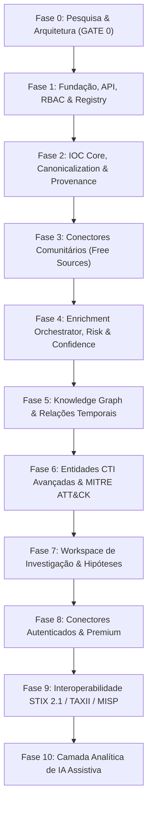

# POSEIDON CTI — Roadmap Modular de Desenvolvimento & Critérios de Gate

> **Documento:** `docs/roadmap.md`  
> **Status:** Aprovado para Phase 0 (Research & Foundation)  
> **Classificação:** Planejamento Estratégico de Engenharia & Qualidade  
> **Data:** 2026-09-20  

---

## 1. Princípios de Engenharia & Governança de Gates

O desenvolvimento do **POSEIDON** é estruturado no ciclo contínuo de 10 passos:
$$\text{RESEARCH} \rightarrow \text{ARCHITECTURE} \rightarrow \text{PLAN} \rightarrow \text{IMPLEMENT} \rightarrow \text{TEST} \rightarrow \text{SECURITY REVIEW} \rightarrow \text{AUDIT} \rightarrow \text{DOCUMENT} \rightarrow \text{GATE}$$

### Regras Mandatórias de Avanço:
1. **Nenhuma fase é encerrada apenas porque "o código roda":** A funcionalidade precisa estar implementada, testada com testes automatizados, integrada, observável, segura, documentada e com sua proveniência preservada.
2. **Desenvolvimento Vertical:** Cada fase entrega uma fatia funcional completa e testável antes da expansão para novos módulos.
3. **Definition of Done (DoD):**
   * [ ] Código implementado com tipagem estrita (Python / TypeScript).
   * [ ] Testes unitários e de integração implementados e passando com cobertura adequada.
   * [ ] Trilha de auditoria e logs estruturados em formato JSON integrados.
   * [ ] Proteções de segurança validadas (RBAC, sanitização, anti-SSRF, segredos protegidos).
   * [ ] Proveniência e rastreabilidade dos dados preservadas integralmente.
   * [ ] Documentação técnica de arquitetura e operação atualizada.
   * [ ] Revisão de segurança aprovada sem vulnerabilidades críticas.

---

## 2. Visão Geral das Fases do Projeto

---

## 3. Detalhamento das Fases

### Fase 0 — Pesquisa, Análise Competitiva & Fundamentos de Arquitetura (CONCLUÍDA)
* **Objetivos:** Definir os alicerces teóricos e arquiteturais da plataforma antes de qualquer implementação de código executável.
* **Entregas:**
  * `docs/research/competitive-analysis.md`: Estudo comparativo minucioso (OpenCTI, MISP, ThreatConnect, Recorded Future, VirusTotal).
  * `docs/research/source-matrix.md`: Matriz de fornecedores de inteligência, termos de uso, cotas, modelos de acesso e rate limits.
  * `docs/architecture/data-model.md`: Ontologia canônica, distinção Observable vs. Indicator, ciclo de vida de IOCs e fórmula de Risk Score.
  * `docs/architecture/architecture.md`: Arquitetura em camadas, SDK de conectores, SSRF Guard e RBAC.
  * `docs/ui/poseidon-ui.md`: Filosofia de design dark, paleta de cores (Blue Graphite, Cyan, Gold), wireframes de Intelligence Cards.
  * `docs/roadmap.md`: Roadmap completo com critérios de aceite e definição dos Gates.
* **Gate 0:** Apresentação formal da documentação e aprovação do plano de implementação da Fase 1.

---

### Fase 1 — Fundação, Autenticação, RBAC, Banco de Dados & Shell Frontend
* **Objetivos:** Construir o esqueleto operacional seguro do Poseidon, estabelecendo a base da API, persistência, controle de acesso e console visual.
* **Tarefas Técnicas:**
  1. Configuração do ambiente de backend (FastAPI 0.115+, SQLAlchemy 2.0 async, Alembic para migrações, Pydantic v2).
  2. Modelagem e migração inicial do schema relacional no PostgreSQL 16 (Users, Roles, Organizations, SourceRegistry, AuditLog).
  3. Implementação do sistema de autenticação via JWT com suporte a tokens rotativos e senhas com hashing Argon2id.
  4. Implementação de RBAC com 6 papéis canônicos (`ADMIN`, `CTI_ANALYST`, `THREAT_HUNTER`, `SOC_ANALYST`, `VIEWER`, `API_CLIENT`).
  5. Desenvolvimento do subsistema de Auditoria Imutável (`AuditLogger`).
  6. Criação do `SourceRegistry` com suporte a encriptação de API keys com AES-256-GCM em repouso.
  7. Inicialização do frontend React 18 + Vite + TypeScript + Tailwind CSS com sidebar responsiva, tema dark e rotas autenticadas.
* **Estratégia de Testes:**
  * Testes de autenticação (login, token inválido, token expirado).
  * Testes de controle de autorização RBAC em todas as rotas da API.
  * Testes de criptografia/decriptografia de segredos e não-exposição em logs ou payloads.
* **Critérios de Aceite:**
  * Nenhum segredo exposto em texto claro.
  * Trilha de auditoria gerando registros estruturados para todas as operações sensíveis.
  * Shell do frontend responsivo navegável com todas as abas principais roteadas.

---

### Fase 2 — IOC Core, Normalização, Canonicalização, Desduplicação & Ciclo de Vida
* **Objetivos:** Implementar o núcleo de dados de indicadores e observáveis (SCOs vs SDOs), com normalização determinística e rastreabilidade total de proveniência.
* **Tarefas Técnicas:**
  1. Criação das entidades `CanonicalIOC`, `RawSourceRecord`, `NormalizedEvidence` e `Sighting`.
  2. Implementação do **Normalization Engine**:
     * Canonicalização rigorosa de IPv4, IPv6, Domain, URL, FQDN, Hashes (MD5/SHA1/SHA256/SHA512), CVE, Email e ASN.
     * Algoritmos de desfangamento (`hxxp://`, `[.]`, etc.).
  3. Mecanismo de desduplicação e **Merge de Entidades**: o mesmo IOC proveniente de fontes distintas é unificado na entidade canônica, preservando todas as evidências de origem.
  4. Máquina de estados do ciclo de vida do IOC (`NEW` $\rightarrow$ `OBSERVED` $\rightarrow$ `ENRICHED` $\rightarrow$ `ACTIVE` $\rightarrow$ `STALE` $\rightarrow$ `EXPIRED` $\rightarrow$ `REVOKED`).
  5. Endpoints de busca rápida e filtragem multi-critério (por tipo, status, datas de observação).
* **Estratégia de Testes:**
  * Testes unitários exaustivos com vetores de teste maliciosos/defangados.
  * Testes de desduplicação provando que múltiplos inputs criam 1 entidade canônica com $N$ evidências.
* **Critérios de Aceite:**
  * Nenhum payload original destruído ou sobreposto.
  * Hashes e domínios normalizados deterministicamente em 100% dos casos de teste.

---

### Fase 3 — Conectores Comunitários (Fontes Gratuitas)
* **Objetivos:** Implementar os adapters isolados para as fontes gratuitas prioritárias dentro do `BaseCTIConnector` SDK.
* **Tarefas Técnicas (Desenvolvimento Modular - 1 Conector por vez com Gate individual):**
  1. **ThreatFox Connector:** Ingestão de IOCs de C2, famílias de malware, tags e exportações recentes via API com `Auth-Key`.
  2. **URLhaus Connector:** Consulta e feeds de URLs de distribuição de malware e hashes associados.
  3. **MalwareBazaar Connector:** Consulta de metadados de arquivos, assinaturas YARA, TLSH e famílias de malware.
  4. **AbuseIPDB Connector:** Consulta de reputação de IP, escore de confiança de abuso e categorias de ataque.
  5. **GreyNoise v3 Community Connector:** Classificação de ruído de internet e identificação de infraestrutura benigna de negócios (RIOT).
  6. **VirusTotal Connector (Modo Público):** Consulta de hashes e domínios com controle rígido de 4 req/min e aviso legal obrigatório.
* **Estratégia de Testes:**
  * Mock tests para HTTP 200, 400, 401, 403, 429 e 500 para cada conector.
  * Simulação de falha de conexão e timeout sem derrubar a API do Poseidon.
* **Critérios de Aceite:**
  * Cada conector opera como plugin independente em `app/connectors/`.
  * Rate limits da fonte respeitados rigorosamente pelo conector.

---

### Fase 4 — Enrichment Orchestrator, Correlação, Risco & Confiança
* **Objetivos:** Construir o pipeline de enriquecimento em tempo real e em lote, consolidando consenso entre fontes e cálculo transparente de pontuação de risco.
* **Tarefas Técnicas:**
  1. Desenvolvimento do `EnrichmentOrchestrator` com fila assíncrona, cache Redis e SingleFlight lock.
  2. Implementação do `SSRFGuard` com validação de DNS e bloqueio estrito de IPs privados/metadados de nuvem.
  3. Algoritmo do **Poseidon Risk Score** (0 a 100) com lista explicável de contribuidores positivos, negativos e decaimento temporal.
  4. Algoritmo do **Poseidon Confidence Score** baseado na corroboração entre fontes independentes.
  5. Motor de detecção de conflitos de inteligência (`SourceConflictEngine`).
  6. Interface de enriquecimento no frontend com barra de progresso em tempo real e visualização de consenso.
* **Estratégia de Testes:**
  * Teste de ataque SSRF simulando injeção de `http://169.254.169.254/latest/meta-data/` e `http://127.0.0.1:8000/admin`.
  * Teste de cálculo de risco validando transparência matemática dos contribuidores.
* **Critérios de Aceite:**
  * O motor de SSRF bloqueia 100% das requisições contra infraestrutura privada.
  * O score de risco exibe a lista completa de motivos para cada ponto atribuído.

---

### Fase 5 — Knowledge Graph & Relações Temporais
* **Objetivos:** Conectar entidades através de relacionamentos estruturados e fornecer exploração interativa em grafo e linha do tempo.
* **Tarefas Técnicas:**
  1. Criação da tabela de relacionamentos `EntityRelationship` com tipagem STIX SRO (`communicates-with`, `resolves-to`, `uses`, `targets`, etc.).
  2. Implementação de consultas recursivas em profundidade (CTE de 1 a 5 níveis) com filtragem por data, confiança e tipo.
  3. Visualização em grafo no frontend com **Cytoscape.js** (zoom, layout hierárquico/força, expansão de nós sob demanda).
  4. Módulo de **Temporal Timeline** para rastrear a evolução cronológica de um indicador ou incidente.
* **Critérios de Aceite:**
  * Grafo renderiza com performance fluida (< 200ms para até 1.000 nós) e filtragem por data e risco.
  * Toda aresta do grafo possui botão *"Por que estão relacionados?"* com referência à fonte original.

---

### Fase 6 — Entidades CTI Avançadas & MITRE ATT&CK
* **Objetivos:** Expandir o Poseidon além dos IOCs técnicos, integrando inteligência de Threat Actors, Malware, Campanhas, Vulnerabilidades (CVEs) e a matriz MITRE ATT&CK v16.
* **Tarefas Técnicas:**
  1. Modelagem e endpoints para `ThreatActor`, `MalwareFamily`, `Campaign` e `Vulnerability`.
  2. Ingestor do bundle oficial STIX 2.1 do MITRE ATT&CK Enterprise (Táticas, Técnicas, Sub-técnicas e Mitigações).
  3. Visualizador interativo da matriz ATT&CK correlacionando técnicas observadas aos IOCs e malwares cadastrados.
* **Critérios de Aceite:**
  * Matriz ATT&CK permite filtrar técnicas por ator ou família de malware com link direto para evidências.

---

### Fase 7 — Workspaces de Investigação & Hipóteses Analíticas
* **Objetivos:** Fornecer aos analistas um ambiente de colaboração para triagem e condução de casos complexos.
* **Tarefas Técnicas:**
  1. Modelagem de `InvestigationWorkspace` com controle de permissões por caso e classificação TLP.
  2. Implementação do **Hypothesis Engine** (registro de hipóteses com divisão estrita entre *Evidência A Favor* e *Evidência Contra*).
  3. Módulo de **Watchlists** com alertas automáticos sobre alterações de score ou novas observações.
  4. Geração de relatórios analíticos em Markdown e PDF exportáveis.
* **Critérios de Aceite:**
  * Hipóteses analíticas permanecem formalmente separadas de evidências factuais.

---

### Fase 8 — Conectores Autenticados & Premium
* **Objetivos:** Integrar fontes comerciais e de infraestrutura avançada sem violar termos de uso ou acoplar o núcleo do sistema.
* **Tarefas Técnicas:**
  1. Conector **VirusTotal Premium** (Hunting, Livehunt, VT Graph, downloads privados).
  2. Conectores **Shodan** e **Censys** (mapeamento de serviços, portas e certificados SSL).
  3. Conector **SecurityTrails** (histórico passivo de DNS e enumeração de subdomínios).
* **Critérios de Aceite:**
  * O sistema opera perfeitamente mesmo quando nenhuma fonte premium está configurada.

---

### Fase 9 — Interoperabilidade STIX 2.1, TAXII 2.1 & MISP
* **Objetivos:** Habilitar o Poseidon a consumir e publicar inteligência em padrões abertos da indústria.
* **Tarefas Técnicas:**
  1. Serializador e desserializador bidirecional de bundles STIX 2.1 JSON.
  2. Servidor e cliente **TAXII 2.1** (Descoberta, API Roots, Coleções, Ingestão de Objetos).
  3. Conector de sincronização de eventos com instâncias remotas do **MISP**.
* **Critérios de Aceite:**
  * Validação formal de conformidade com os esquemas oficiais STIX 2.1 do OASIS.

---

### Fase 10 — Camada Analítica de IA Assistiva (AI Analyst)
* **Objetivos:** Integrar inteligência artificial generativa como copiloto investigativo do analista humano, com rastreabilidade total de evidências e proibição de alucinações.
* **Tarefas Técnicas:**
  1. Módulo de sumarização e correlação assistida: respostas estruturadas sempre ancoradas em IDs de IOCs e fontes registradas.
  2. Geração automática de rascunhos de relatórios executivos e técnicos com separação categórica entre *Fatos, Correlações e Hipóteses*.
  3. Assistente de investigação em linguagem natural (busca semântica e traversal de grafos guiado).
* **Critérios de Aceite:**
  * Toda asserção gerada pela IA possui citação explícita para evidências do banco do Poseidon; asserções sem suporte são barradas pelo guardrail de integridade.

---

## 4. Plano Detalhado de Implementação da Fase 1 (Kickoff Imediato)

Após a aprovação do **Gate 0**, a Fase 1 será executada nas seguintes etapas controladas:

1. **Step 1.1 — Scaffold do Backend e Governança de Dependências:**
   * Inicialização de `pyproject.toml` / `requirements.txt` com FastAPI, SQLAlchemy, asyncpg, Pydantic v2, structlog, cryptography, alembic e pytest.
   * Configuração de linters e type-checkers (`ruff`, `mypy`).
2. **Step 1.2 — Banco de Dados & Migrações Alembic:**
   * Setup do container PostgreSQL 16 com extensão `pg_trgm`.
   * Criação dos schemas para `tenants`, `users`, `roles`, `source_registry`, `audit_logs` e `system_settings`.
3. **Step 1.3 — Autenticação, RBAC & Secret Management:**
   * Módulo `app/core/security.py` com hashing Argon2id e geração de JWT tokens.
   * Encriptação AES-256-GCM para chaves de API cadastradas no `source_registry`.
   * Middleware de RBAC e validação de permissões granulares por rota.
4. **Step 1.4 — Audit Subsystem:**
   * Middleware assíncrono para captura e gravação de eventos de auditoria com IP, rota, usuário e dados anteriores/novos.
5. **Step 1.5 — Frontend Shell (React + Vite + Tailwind):**
   * Setup do boilerplate React com TypeScript e Tailwind CSS.
   * Implementação da barra de navegação responsiva com a paleta dark/blue/gold do Poseidon.
   * Telas iniciais de Login, Dashboard Placeholder e Configuração de Fontes.
6. **Step 1.6 — Testes Automatizados & Gate 1 Review:**
   * Execução da suíte de testes de autenticação, permissões e integridade de segredos.
   * Emissão do relatório de auditoria e validação de avanço para a Fase 2.
