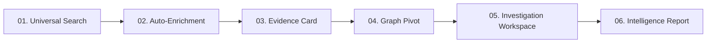

# POSEIDON CTI — Blueprint de Interface de Usuário & Experiência Analítica (UI/UX)

> **Documento:** `docs/ui/poseidon-ui.md`  
> **Status:** Aprovado para Phase 0 (Research & Foundation)  
> **Classificação:** Design System & Arquitetura de Interface de CTI  
> **Data:** 2026-09-20  

---

## 1. Filosofia de Design & Identidade Visual

A interface do **POSEIDON** foi concebida exclusivamente para analistas de Cyber Threat Intelligence, Threat Hunters e operadores de SOC Tier 3. Ela rejeita categoricamente layouts genéricos de dashboards corporativos ("SaaS CRUD templates") em favor de um ambiente de **alta densidade informacional, rápida tomada de decisão, estética dark cirúrgica e contexto investigativo contínuo**.

### 1.1 Paleta Cromática Institucional

| Papel Semântico | Token de Design | Código HEX | Aplicação no Sistema |
| :--- | :--- | :--- | :--- |
| **Primary Canvas** | `--poseidon-bg-base` | `#080c14` | Fundo principal da aplicação (Deep Void Blue) |
| **Surface Dark** | `--poseidon-bg-surface` | `#0f172a` | Fundo de cartões, painéis laterais e modais |
| **Surface Elevated** | `--poseidon-bg-elevated` | `#1e293b` | Barras de ferramentas, cabeçalhos de tabela, menus suspensos |
| **Borders & Dividers** | `--poseidon-border` | `#334155` | Linhas de divisão sutis de alta definição (1px) |
| **Secondary Brand** | `--poseidon-cyan-electric` | `#38bdf8` | Links ativos, grafos de relação, foco de input, indicadores |
| **Accent Gold** | `--poseidon-gold-accent` | `#f59e0b` | **Inteligência crítica**, alertas de alta severidade, status premium |
| **Gold Burnished** | `--poseidon-gold-burnished`| `#d97706` | Badges de Threat Actors de alto perfil, botões de ação primária |
| **Threat Malicious** | `--poseidon-risk-critical` | `#ef4444` | Risk Score > 75, C2 confirmado, infecção ativa |
| **Threat Suspicious**| `--poseidon-risk-high` | `#f97316` | Risk Score 50-74, reputação duvidosa, abuso recente |
| **Threat Neutral** | `--poseidon-risk-neutral` | `#64748b` | Observável sem evidência maliciosa, sem histórico |
| **Benign Verified** | `--poseidon-status-benign` | `#10b981` | Infraestrutura legítima verificada (RIOT / CDNs / Allowlists) |

> [!IMPORTANT]
> O tom **Gold (`#f59e0b`)** deve ser aplicado de forma parcimoniosa e estratégica: apenas para destacar nós de relevância extrema, indicadores com alto consenso de risco, badges de Threat Actors de primeiro escalão ou elementos de governança executiva. Não deve ser usado como cor de fundo geral.

---

## 2. Arquitetura de Navegação Global

A barra de navegação lateral (Sidebar retrátil) organiza as capacidades operacionais do Poseidon em blocos lógicos:

```
POSEIDON CTI CONSOLE
├── 01. DASHBOARD
│   └── Intelligence Overview (Métricas, tendências, ingestão recente)
├── 02. INTELLIGENCE (Entidades Canônicas)
│   ├── IOCs (Indicadores e Observáveis consolidados)
│   ├── Observables (Fatos brutos / SCOs)
│   ├── Indicators (Padrões de detecção / SDOs)
│   ├── Malware Families (Assinaturas, amostras, C2s)
│   ├── Threat Actors (Grupos de ameaça, motivação, aliases)
│   ├── Campaigns (Operações de adversários no tempo)
│   ├── Vulnerabilities (CVEs, exploração ativa, PoCs)
│   ├── Infrastructure (ASNs, subnets, certificados SSL/TLS)
│   └── Reports (Relatórios de inteligência técnicos e executivos)
├── 03. INVESTIGATIONS (Ambiente de Trabalho Ativo)
│   ├── Active Workspaces (Investigações colaborativas em curso)
│   ├── Hypothesis Tracker (Matriz de Evidências A Favor vs Contra)
│   └── Watchlists (Monitoramento contínuo de alvos e infraestrutura)
├── 04. ENRICHMENT ENGINE
│   ├── Single Lookup (Triagem instantânea)
│   ├── Bulk IOC Analysis (Análise em lote de múltiplos artefatos)
│   ├── Queue Monitor (Fila de processamento assíncrono de conectores)
│   └── Enrichment History (Trilha histórica de consultas externas)
├── 05. SOURCES & CONNECTORS
│   ├── Connected Sources (Fontes ativas com health check em tempo real)
│   ├── Source Matrix (Catálogo de integrações gratuitas e pagas)
│   ├── Feeds Ingestion (Cronogramas de sincronização de feeds)
│   └── Rate Limits & Quotas (Medidores de consumo de API)
├── 06. VISUAL EXPLORATION
│   ├── Knowledge Graph (Navegação em grafo relacional)
│   ├── Temporal Timeline (Linha do tempo interativa de eventos)
│   └── MITRE ATT&CK Navigator (Mapeamento tático de técnicas)
└── 07. ADMINISTRATION
    ├── Source Settings & Encrypted Secrets (Gestão de chaves de API)
    ├── Users & RBAC Permissions (Controle de privilégios de acesso)
    └── Audit Log Viewer (Trilha imutável de ações)
```

---

## 3. Poseidon Intelligence Card (Wireframe do Componente Central)

O **Intelligence Card** é o artefato visual definitivo ao inspecionar qualquer indicador. Ele responde instantaneamente às perguntas centrais do analista: *O quê, De onde veio, Quando ocorreu, Quem está associado, Qual a evidência factual e Qual o nível de confiança*.

### Wireframe ASCII de Alta Fidelidade

```
┌────────────────────────────────────────────────────────────────────────────────────────────────────────┐
│  POSEIDON INTELLIGENCE CARD :: CANONICAL IOC                                       [EXPORT] [INVESTIGATE] │
├────────────────────────────────────────────────────────────────────────────────────────────────────────┤
│  185.220.101.5                                                          TLP:AMBER+STRICT | SCO: IPv4  │
│  Canonical Hash: a89f21b7c8... | Normalization: Validated               Classification: MALICIOUS C2   │
├────────────────────────────────────────────────────────────────────────────────────────────────────────┤
│  [ RISK SCORE: 87 / 100 ]            [ CONFIDENCE: HIGH (84%) ]           [ STATUS: ACTIVE ]           │
│  ████████████████████░░░░            ██████████████████░░░░░░             First Seen: 2026-08-14 09:12 │
│  Contributors:                       Consensus: 4/5 Sources Malicious     Last Seen:  2026-09-20 14:05 │
│  +30 ThreatFox (Active C2)           Corroboration: Strong Independent    Sightings:  48 observations  │
│  +25 AbuseIPDB (98% confidence)      Decay Factor: -3 (Fresh activity)    Sources:    5 connectors     │
│  +20 Malware Association (Lumma)     Contradictions: 0 (No RIOT match)    ASN:        AS208294         │
│  +15 Multiple Independent Sources    Analyst Override: None               Country:    DE (Germany)     │
├────────────────────────────────────────────────────────────────────────────────────────────────────────┤
│  TABS: [Overview] [Evidence (5)] [Enrichment] [Graph (12)] [Sightings (48)] [ATT&CK (4)] [Audit Log]   │
├────────────────────────────────────────────────────────────────────────────────────────────────────────┤
│  OVERVIEW SUMMARY & ASSOCIATED ENTITIES:                                                               │
│                                                                                                        │
│  Malware Association:                                                                                  │
│  • LummaStealer (Family: Infostealer) ── Conf: 92% ── Source: ThreatFox #48291                         │
│  • RedLine Stealer (Historical)       ── Conf: 65% ── Source: URLhaus Payload Feed                     │
│                                                                                                        │
│  Associated Infrastructure:                                                                            │
│  • Domain: secure-update-token[.]live ── Communicates with ── Resolves to: 185.220.101.5             │
│  • SSL Cert SHA256: 3b18e... (Self-signed, CN=localhost, Issuer=Lumma Botnet Cert)                    │
│                                                                                                        │
│  Mitre ATT&CK Techniques:                                                                              │
│  • T1071.001 (Application Layer Protocol: Web Protocols)                                              │
│  • T1105 (Ingress Tool Transfer)                                                                       │
│  • T1566.002 (Phishing: Spearphishing Link)                                                            │
│                                                                                                        │
│  Source Consensus Breakdown:                                                                           │
│  ┌──────────────────┬──────────────┬──────────────────┬─────────────────┬───────────────────────────┐  │
│  │ Source           │ Status       │ Classification   │ Source Conf.    │ Last Verified             │  │
│  ├──────────────────┼──────────────┼──────────────────┼─────────────────┼───────────────────────────┤  │
│  │ ThreatFox        │ CONNECTED    │ Botnet C2        │ 100%            │ 2026-09-20 14:02 UTC      │  │
│  │ AbuseIPDB        │ CONNECTED    │ High Abuse (98%) │ 98% (41 reports)│ 2026-09-20 12:45 UTC      │  │
│  │ URLhaus          │ CONNECTED    │ Payload Delivery │ 90%             │ 2026-09-19 18:20 UTC      │  │
│  │ GreyNoise v3     │ CONNECTED    │ Malicious Noise  │ High            │ 2026-09-18 04:11 UTC      │  │
│  │ VirusTotal       │ PUBLIC_MODE  │ 14/72 Detections │ 75%             │ 2026-09-20 08:30 UTC      │  │
│  └──────────────────┴──────────────┴──────────────────┴─────────────────┴───────────────────────────┘  │
└────────────────────────────────────────────────────────────────────────────────────────────────────────┘
```

---

## 4. Fluxo de UX: Da Busca à Investigação Profunda

O Poseidon reduz drasticamente o tempo gasto em alternância de abas (*context switching*). O ciclo investigativo é unificado:



### 4.1 Experiência de Enriquecimento em Tempo Real
Ao solicitar o enriquecimento de um IOC ou lote de IOCs, a interface apresenta uma barra de status dinâmica e transparente:

```
[ ENRICHING IOC: 185.220.101.5 ] ══════════════════════════════════════ [ 85% Concluído ]
  ThreatFox        [ ✓ SUCCESS ]   - 2 C2 observations found (124ms)
  AbuseIPDB        [ ✓ SUCCESS ]   - 41 abuse reports, confidence 98% (310ms)
  URLhaus          [ ✓ SUCCESS ]   - 3 payloads delivery links (190ms)
  GreyNoise v3     [ ✓ SUCCESS ]   - Malicious scanner classification (412ms)
  VirusTotal       [ ⚠ NOT_CONFIGURED ] - Chave de API não informada em Settings
  Shodan           [ ℹ SKIPPED ]   - Política de enriquecimento econômico ativa (Free-first)
```

---

## 5. Interface de Análise de IOCs em Lote (Bulk IOC Analysis)

Analistas frequentemente precisam processar relatórios em formato bruto, logs de firewall ou despejos de memória com dezenas de artefatos simultâneos.

A tela **Bulk IOC Analysis** oferece:
1. **Área de Entrada com Auto-Parsing:** Permite colar texto livre, arquivos CSV, dumps de logs ou listas separadas por quebra de linha. O motor de expressões regulares do Poseidon identifica e desduplica automaticamente IPs, domínios, URLs e hashes.
2. **Defang Automático:** Identifica formatos como `hxxp://`, `example[.]com`, `192[.]168[.]1[.]1` e normaliza para formato canônico sem alterar o texto original do arquivo submetido.
3. **Tabela de Resultados com Ordenação por Risco e Confiança:**
   * Colunas: `IOC`, `Type`, `Risk Score`, `Confidence`, `Malware Family`, `Threat Actor`, `Sources Count`, `First Seen`, `Actions`.
   * Filtros dinâmicos: `Risk > 75`, `Sources >= 3`, `Only active C2`.
   * Exportação instantânea em **CSV**, **JSON** ou **STIX 2.1 Bundle**.

---

## 6. Telas de Configuração & Gestão de Conectores (Source Center)

A tela `Settings -> Intelligence Sources` centraliza a governança de integrações externas:
* **Cards Informativos por Conector:** Exibe Logo, Nome, Categoria (`COMMUNITY`, `FREE_WITH_ACCOUNT`, `PAID`), Estado (`CONNECTED`, `RATE_LIMITED`, `AUTH_FAILED`), Latência média e Medidor de Quota (ex: `AbuseIPDB: 482 / 1.000 requisições restantes hoje`).
* **Modal de Credenciais Seguras:**
  * Campo de inserção de chave mascarado por padrão (`••••••••••••9F3A`).
  * Botão de teste instantâneo: `[ Test Connection ]` (executa probe de probe e exibe o tempo de resposta em milissegundos).
  * Chave seletora obrigatória para integrações com restrições comerciais (ex: VirusTotal `Public` vs `Enterprise`).
* **Trilha de Auditoria Visível:** Exibe quem alterou a chave de API e a data do último teste com sucesso.

---

## 7. Diretrizes de Estados Vazios e Mensagens de Erro

Para assegurar clareza cognitiva ao analista:
* **Nunca apresentar uma tela vazia sem contexto:**
  * Em vez de uma tabela em branco, exibir: *"Nenhuma evidência registrada para este indicador nas fontes configuradas. Deseja disparar um enriquecimento manual ou adicionar observações analíticas?"*
* **Diferenciar expressamente 'Não Encontrado' de 'Benigno':**
  * Se uma fonte não possuir dados sobre um hash, a interface rotula como **`NO DATA IN SOURCE`** (cor neutra cinza), e nunca como **`CLEAN / SAFE`** (verde).
* **Erros de API transparentes e acionáveis:**
  * Em vez de *"Error 500"* ou *"Failed to fetch"*, a interface exibe: *"A API do GreyNoise retornou HTTP 429 (Cota de 50 buscas semanais esgotada). O conector entrará em pausa até o próximo ciclo de renovação em 24h."*
